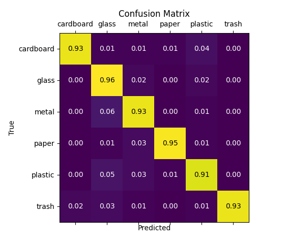

# Waste-Classification-Project

This is a CNN model trained to classify images of waste into 6 categories. Model built using Tensorflow Keras and Sklearn. Demo built using PySimpleGUI and Matplotlib.

Submission for University of Lincoln BSc Computer Science Dissertation 2021

## Abstract
Deep learning is a subfield of machine learning that has become more integrated into everyday life. This is because of its ability to learn information, similarly to how a human brain learns information. Deep learning also outperforms other machine learning methods and is able to learn data completely unsupervised. With the use of deep learning, waste and recycling can be effectively sorted into their material properties to achieve a more efficient way of disposing of waste. Currently, only 45% of waste is recycled in the UK, meaning the majority of waste goes to landfill. Therefore, minimising the negative environmental effects this has on the planet should be addressed. This project communicates the methods, design and development of a deep feed-forward neural network, and proves that the classification of waste can be done automatically to great accuracy.


## Example results


## Architecture


## Confusion Matrix



## Demo


## Install

```bash
pip install -r requirements.txt
```

## Run
### Demo
```bash
python demo.py
```

### Train
```bash
python train_model.py
```
